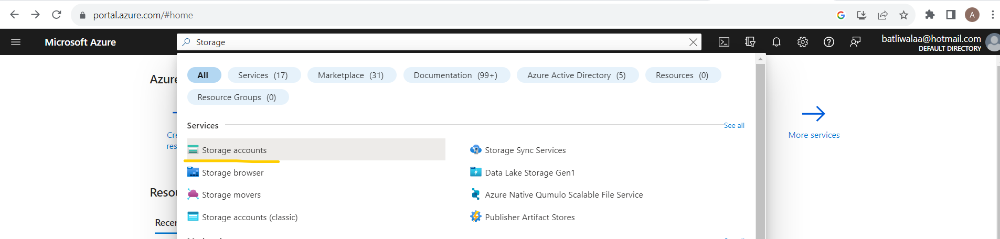
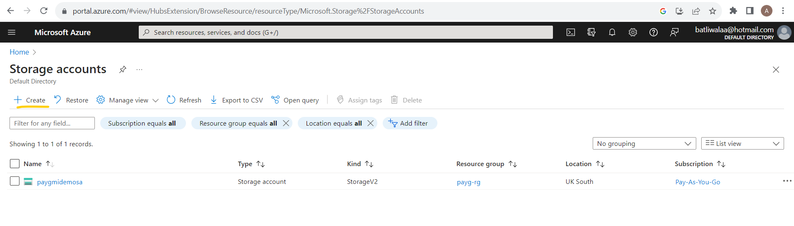
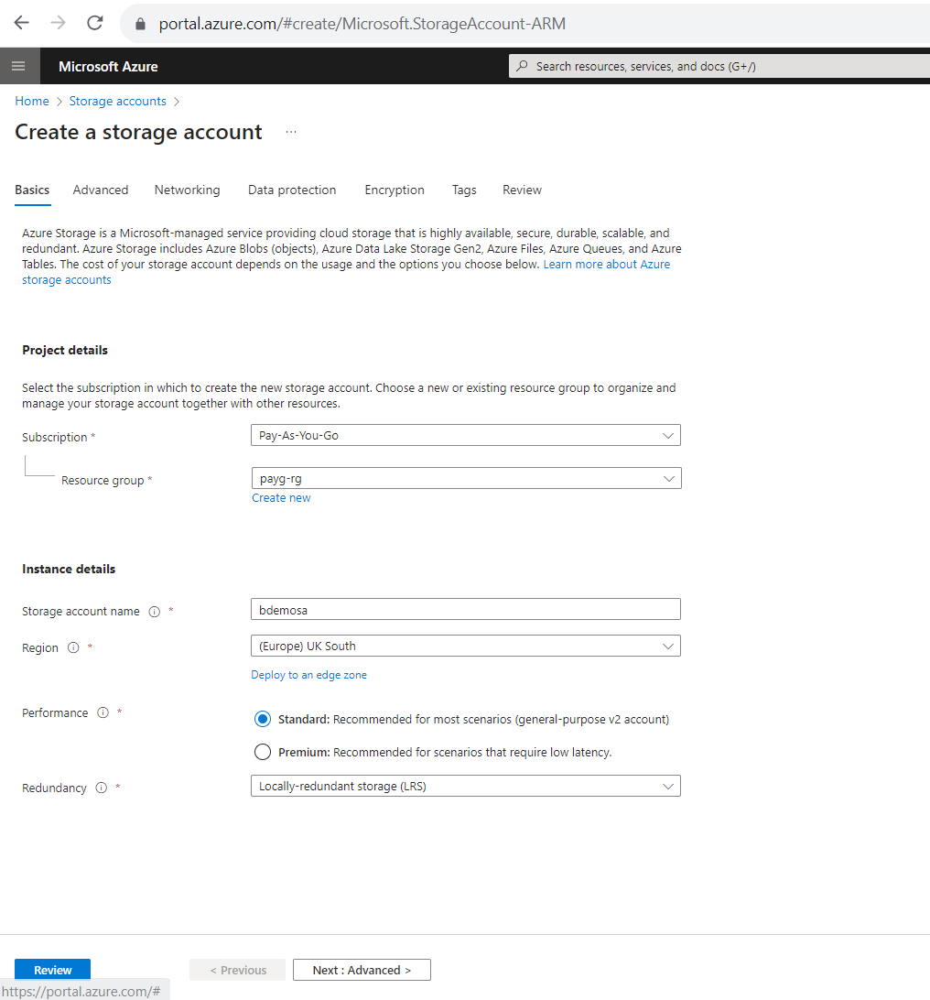
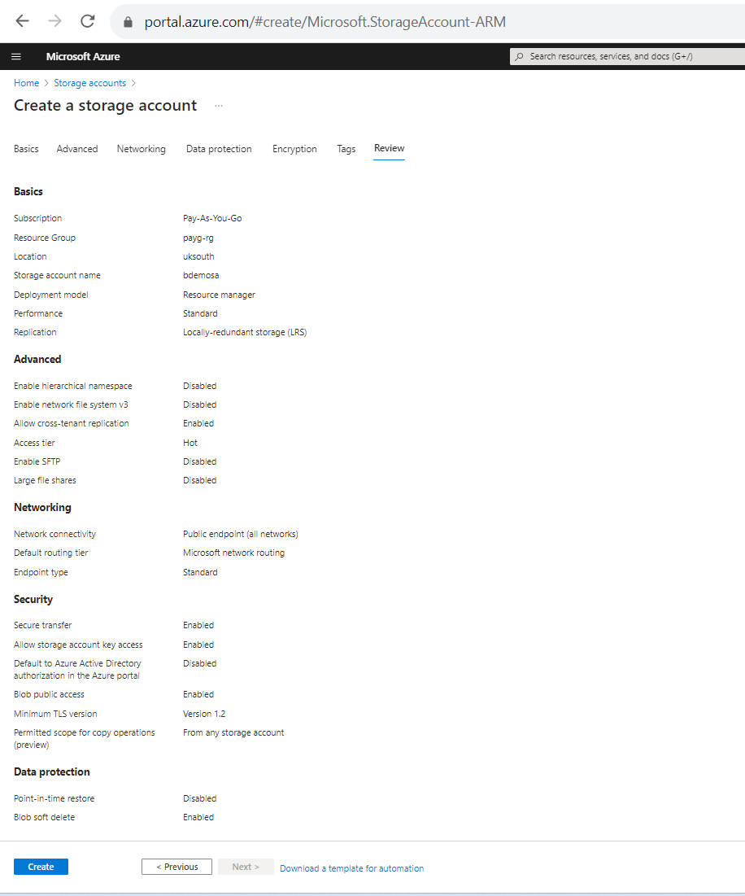
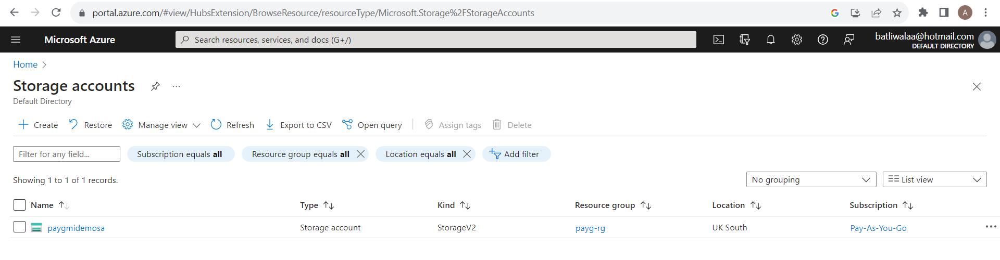
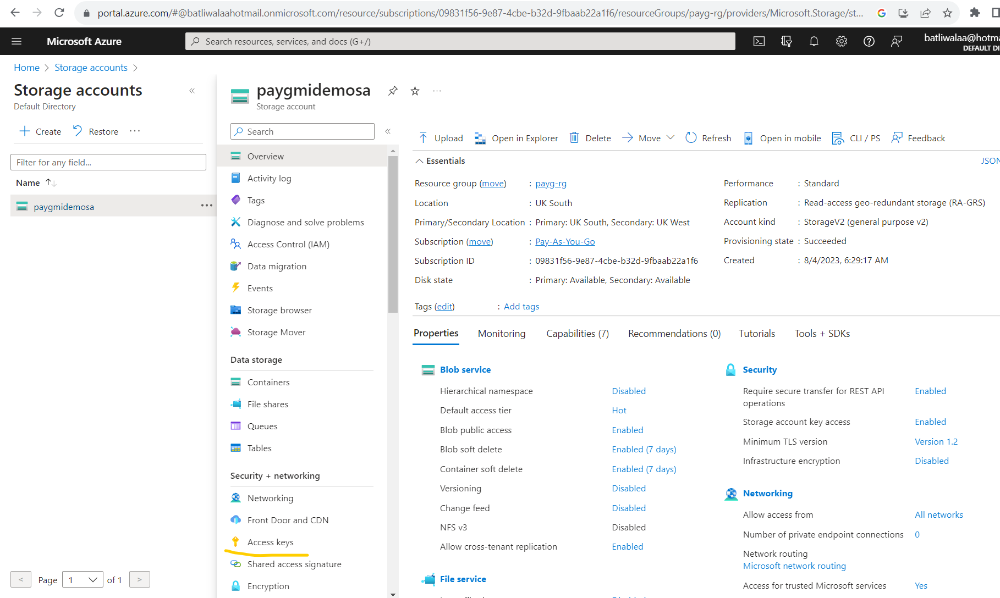
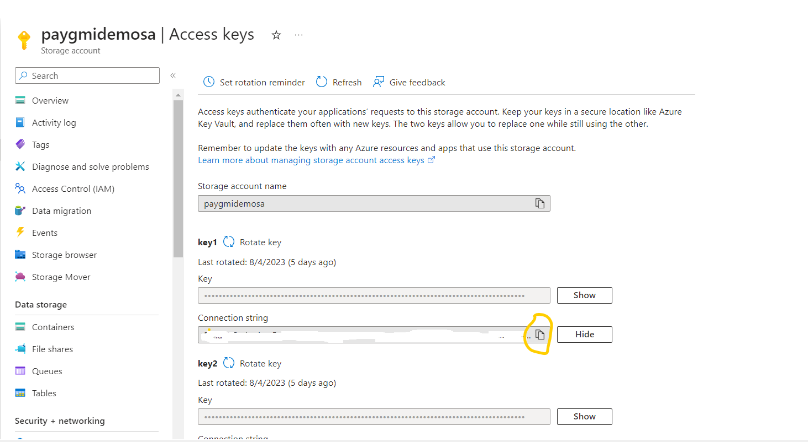
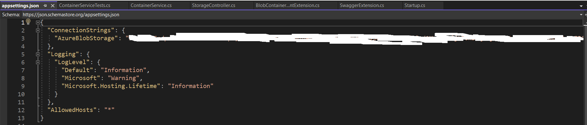

# How to integrate Azure Blob Storage in ASP.NET Core Web Api
The example shows how to use Azure Blob Storage with ASP.Net core Rest APIs

## Prerequisites
- Azure Subscription
- Storage Account
- .NET 7.0
- Visual Studio 2022

## Create Storage Account
1. Log into [Azure Portal](https://portal.azure.com/)
1. Search for Storage Account and open Storage account page

1. Click on 'Create' for new Storage account

1. Create new Storage account page will be presented, fill in the basics
- Subscription
- Resource Group (Select existing or create new)
- Storage account name
- Region (I am from UK, selected 'UK South')
- Performance (For learning purpose Standard is okay)
- Redundancy (I have selected **Locally-redundant storage (LRS)**)

1. Click on 'Review' and then 'Create'

1. On Storage account overview page check to see the newly created storage

## Storage - Connection string
From the Storage account overview page select on the newly created storage (mine is 'paygmidemosa') and click on 'Access keys'

Click on show for 'Connection String' and then copy to appsettings.json file in web api project.

